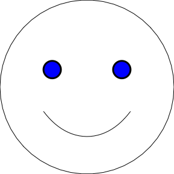
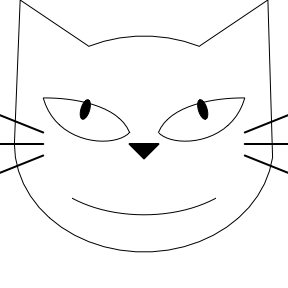

<!-- README.md is generated from README.Rmd. Please edit that file -->

# portrait

<!-- badges: start -->
<!-- badges: end -->

This package is made for demonstration purposes and not a serious
package.

The `portrait` is an R-package that draws faces by defining its facial
components.

## Installation

``` r
# install.packages("remotes")
remotes::install_github("emitanaka/portrait")
```

## Getting started

``` r
library(portrait)
```

Draw a standard face:

``` r
face()
```

<!-- -->

Change eye color:

``` r
face() + sketch_eyes(fill = "blue", size.outline = 3)
```

<!-- -->

Change eye color and sad face:

``` r
face() + 
  sketch_eyes(fill = "blue", size.outline = 3) +
  sketch_mouth(smile = -1)
```

<!-- -->

Change to a cat eye:

``` r
face() + cat_eyes()
```

<!-- -->
